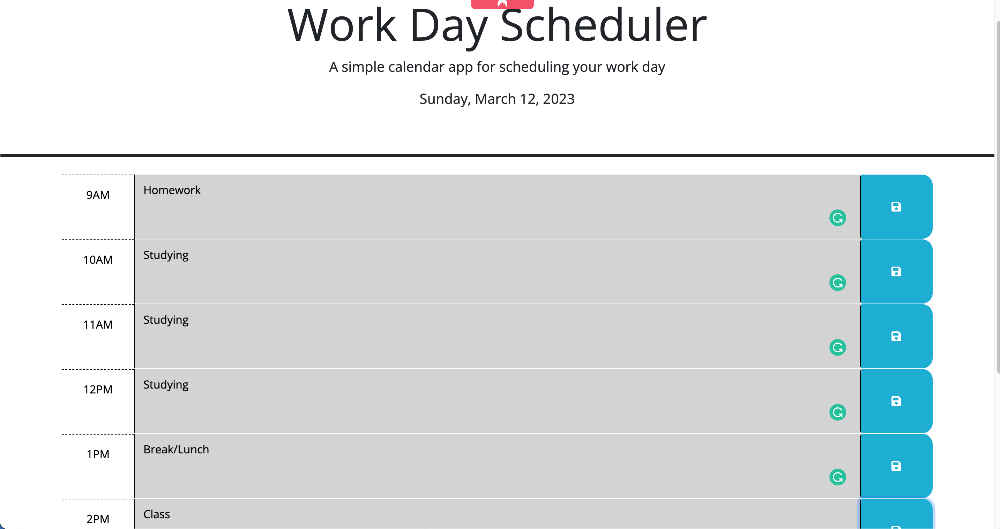
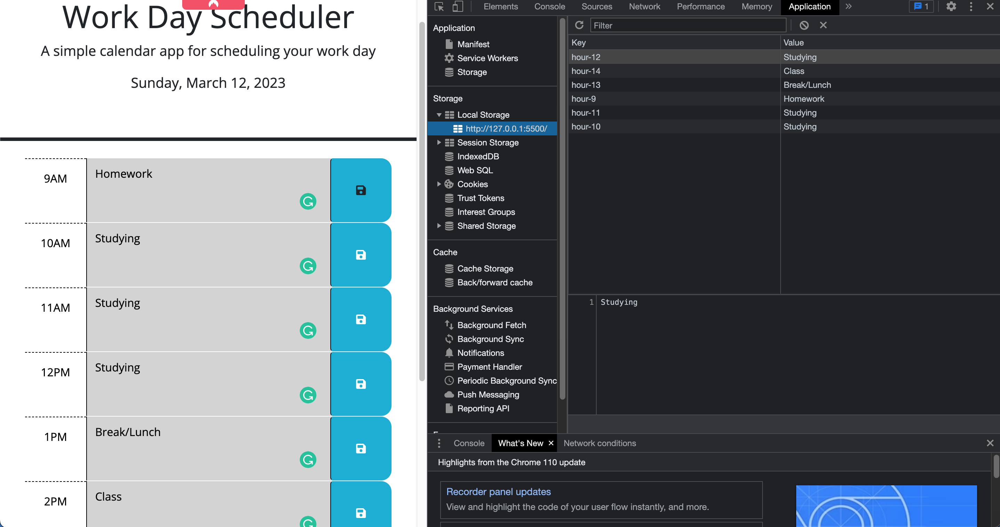

# Code Quiz 

Project Page: [Project Page](https://timothymichaelcook.github.io/5-work-day-scheduler-cook)
Project Repo: [Github-repo](https://github.com/timothymichaelcook/5-work-day-scheduler-cook)


## Description

REDO
The focus of this project was to create a simple calendar application that takes a user's input in a text field and saves to the browser's local storage. This allows users to save events for each hour of the day. This application features dynamically updated HTML and runs in the browser. Users can delete their saved inputs in the application tab of the inspect window by right clicking input and choosing delete.

## User Story

```
- AS A employee with a busy schedule
- I WANT to add important events to a daily planner
- SO THAT I can manage my time effectively
```

## Installation

N/A

## Usage

REDO
Users enter text in the input field and can save that input via the save icon to the right of the field. A message will pop up for five seconds confirming the input has been saved to local storage. Text input fields will display different colors based on whether field represents a past, present, or future time. 

## Credits

University of Richmond Coding Bootcamp

## License

MIT License

## Screenshots





## Contact
Timothy Cook - timothy.michael.cook@gmail.com
